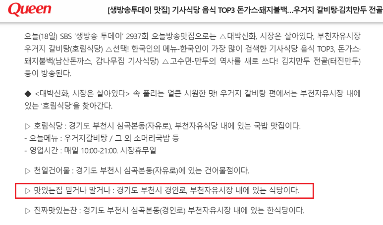
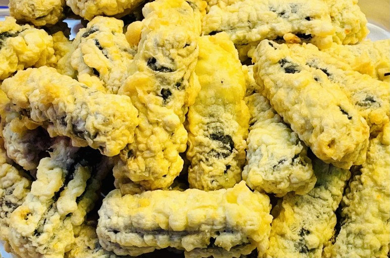
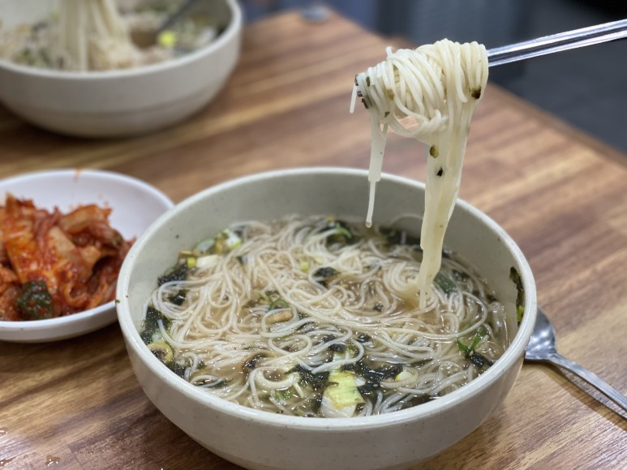

## [부천 자유시장 맛집 추천] 믿거나 말거나 : 꾸덕꾸덕한 시장 떡볶이 진짜 맛있어요ㅠ

안녕하세요, 취준생 블로거 'seup'입니다. 

오늘은 제가 사는 동네인 부천의 맛집을

하나 소개해드릴까 해요.

실은,,, 제 작은 어머님께서 하시는 가게인데!

부천 자유시장에서 꽤 오랫동안 장사를 하셨어요.

(제가 지금 27살이니까.. 약 30년?

이상은 하셨을 것 같은데..?!)

​

​

​

하여튼!! 

전 그냥 매번 가면 맛있게 차려주시니까

제 입에만 맛있나 보다? 하고 있었는데

최근에 생생정보통까지 나왔다고 해서

모두한테 다 맛있는 거구나?! 하고 알게 되어서,,

http://www.queen.co.kr/news/articleView.html?idxno=369244나름 조카가 블로그를 운영하고 있으니!

제 포스팅이 작게나마 작은 엄마 가게에 

도움이 될까 싶어 이렇게 

맛집 소개를 하게 되었습니다 :)

---

꾸덕꾸덕한 떡볶이!

자 우선 소개해 드릴 건 떡볶이입니다.

사실.. 제가 제일 좋아하는 메뉴인데요!

요즘은 하도 배달이 잘 발달해서

엽떡, 배떡.. 신전? 이런 떡볶이 시켜 먹잖아요?

​

​

​

근데 그런 떡볶이도 하루 이틀이지

막 가끔씩은 꾸덕한? 시장 느낌 물씬 나는?

그런 떡볶이가 끌릴 때가 있거든요.. 

(다들 아시죠.. ? :)

특히나,, 이게 부천 분들이라면 아실 텐데..

부천역 로데오거리에서

술 한잔 먹고 집 가기 전에

딱 떡볶이가 땡길 때가 있거든요?

​

​

​

전 술 먹고는 무조건 시장 떡볶이

꾸덕한 떡볶이를 찾는답니다 ㅋㅋㅋㅋ

아래 사진을 보시면 아실 텐데..

진짜 그 커다란 불판 위에서 

꾸덕꾸덕하게 데워진 떡볶이 먹으면ㅠ

(아 오늘 집 가다가 들리던가 해야겠네요

글 쓰다 보니까 또 먹고 싶어졌,,)

혹시나 동네 친구들끼리

간쏘(간단하게 쏘주:) 가 하고 싶으시다면?

요 떡볶이를 추천해 드립니다! 

​

​

​

더군다나 밀떡이기 때문에 식어도 

그 식감이 계속 살아있어요!

(작은 엄마가 이 가게 이전에

떡볶이 가게도 오래 하셨기 때문에

쌀떡 밀떡 중에 뭐가 더 시장 느낌인지 

아시는 거죠 ㅎ)

---

떡볶이엔 뭐다? 튀김과 순대!

다음은.. 

떡볶이랑 같이 먹을 만한 것들이 필요하겠죠?

바로.... "튀김" 입니다 !

튀김은 뭐 각자 원하는 스타일에 따라 

골라드시면 되는데요. 

​

​

​

흠.. 개인적으로 전 야채튀김이나

고구마튀김을 좋아합니다

(꿀꺽..,,)

그리고 난 튀김은 느끼하다?

하시는 분들은 순대를 드시면 됩니다 ㅎ

​

​

​

원하시는 부위 간이든 허파든

"OO 좀 많이 주세요!" 하신 다음에

떡볶이랑 해서 뙇..!

​

​

​

그리고 소주 란짠해주시면 됩니다.

(아님 콜라 드셔도 잘 맞아요 :)

---

배가 출출해? 고럼 잔치국수!

그리고 만일?배가 출출하실 때는

잔치국수를 드시면 됩니당!

(개인적으로 작은 엄마네 김치랑

깍두기(이게 찐..) 이 맛있어서)

​

​

​

저는 항상 가면 

먼저 국수랑 김치로 배를 채우고!

​

​

​

이제.. 뭐 동생이나 아니면 

작은 네 친척 동생들이랑 해서

떡볶이랑 순대에 소주 한 잔 먹기도 하고.. 

ㅋㅋㅋㅋㅋㅋㅋ

(이런게 인생입니다 여러분)

​

​

​

아! 잔치국수 사진은 아래에 있는데요.

아마 제가 워낙 국수를 좋아해서 

1인분 양보다는 더 많을 거예요..? 아마?

따로 1인분 주세요..라고 시켜본 적이 없어서;;

만약에 많이 먹고 싶으시면 

걍.. 저를 파세요 'seup'님 블로그

보고 왔다고 서비스 많이 주세요 하시면..

​

​

​

제가 말해두겠습니다 ㅋㅋㅋ

---

안주는 똥집, 순대볶음, 닭발!

아니다! 나는 좀 색다른 메뉴가 끌린다.

나는 시장까지 왔는데 분식으로

성이 안찬다! 하시는 분들은?!

​

​

똥집이나 순대볶음!!

그리고 닭발을 드시면 됩니다.

그리고 아니면,

소주 안주나 하나 사가고 싶다!? 하는 분들도

똥집, 순대볶음, 닭발을 포장하시면 됩니다.

​

참고로 닭발을

무뼈가 아닌 뼈 있는게 찐인거 아시죠..?

---

그리고.. 사실 저번에 가족들이랑 술 마시면서 

얘기 들어보니까,, 

​

​

​

작은 엄마네 가게 소스가 맛있다고 소문이 나서

소스만 막 사가시는 분들도 있다고 하더라고요

​

​

​

그래서 소스만 따로 특허 내고 싶으시다고

막 고민 중 이 시기도 하던데..

혹시나 요식업 하시는 분들은 댓글로 말씀 좀 해주세요.. ㅎ

​

​

마지막으로 간판이랑 메뉴판 보여드리고 마칩니다!

​

찾아보니까! 저 말고도 이미 다른

블로거 및 유튜버 분들이 맛집 소개로 포스팅을

하셨더군요.. (크흠,,)

​

​

보니까 다른 분들은 닭곰탕을 주로 드시네요?

요즘 추우니까 다음에 눈 올 때 한번

닭곰탕 한그릇 때리러 가야겠습니다!

(헿..)

​

---

다른 블로거 분들

https://blog.naver.com/sielle83/222177807011

[[부천 자유시장 맛집] 유림분식 2,000원의 행복 & 믿거나말거나 떡볶이에 소주](https://blog.naver.com/sielle83/222177807011) : 유림분식 / 경기도 부천시 자유로 33 (심곡본동 543) 구름길B56 전화번호 모름 영업시간 모름 규모도 크고...

https://blog.naver.com/haha-family/222550361228

[[부천맛집]부천자유시장 유림분식,믿거나말거나](https://blog.naver.com/haha-family/222550361228) : 안녕하세요. 늦둥이 블로거 좋남좋아입니다. 지난 일요일 점심에 급분식이 땡겨 무얼 먹을까 고민하다가 싸...

https://www.youtube.com/watch?v=d1NurScOaHI

​

믿거나 말거나 위치

네이버 지도 : http://naver.me/FJnMwbuT

카카오맵 : https://place.map.kakao.com/1042493152

​

​

 해시태그 : #노포맛집 #시장맛집 #부천자유시장 #부천맛집 #부천역맛집 #부천믿거나말거나 #부천분식맛집 #부천떡볶이맛집 #부천역분식집 #부천역술집추천 #낮술맛집 #안주맛집