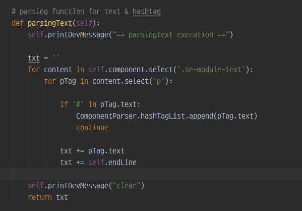
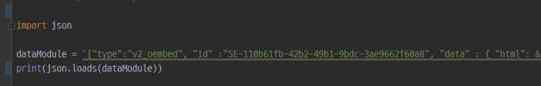
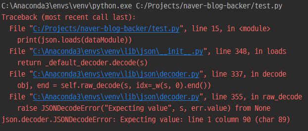

## 파이썬을 이용한 네이버 블로그 백커(백링크 & 백업) 프로젝트(3) : 네이버 블로그 컴포넌트 파싱(parsing)과 HTML escape 문자열을 JSON decode하는 방법

안녕하세요, 취준생 블로거 'seup'입니다. 제가 이번에 진행하는 프로젝트는 파이썬을 이용하여 자기의 네이버 블로그를 백업 및 백링크를 생성할 수 있도록 하는 프로젝트를 기획 및 개발 중입니다.

​

​

해당 프로젝트를 하게 된 이유와 목표는 이 글에서 이미 한 번 설명했기 때문에 생략합니다만, 요지만 말씀드리자면 개개인이 운영하는 네이버 블로그를 '키자드'와 같은 플랫폼 없이 개인이 백링크(구글 검색 등록)을 하기 위함과 동시에 개인이 열심히 작성한 글들에 대한 데이터를 개인 스스로도 백업(보관)하기 위함입니다.

​

​

이 글은 해당 프로젝트 진행과정의 3번째 글입니다.

---

지난번에 이어 지금은 각 컴포넌트들을 파싱 작업 중에 있습니다. 기본적으로는 아래와 같이 심플하게 실제 텍스트가 들어있는 부분을 셀렉트하고 beautifulSoup에서 지원하는 text() 함수를 이용하여 바로 가져올 수 있었습니다.

​



하지만 일부 컴포넌트들은 (이미지, 비디오, 파일, 임베디드 영상) 단순히 텍스트 데이터만을 가져와야 하는 것이 아니라 다른 URL 주소들을 가져와야 했습니다. 이제 여기서 문제가 발생합니다.

​

​

아래의 예시를 보시겠습니다. 이런 블로그 글 상에 임베드 되어있는 유툽 영상들은 내부적으로 바로 기재된 것이 아니라 script 태그를 이용하여 다른 곳에 있는 데이터를 그냥 띄워주게 됩니다. (자바스크립트를 이용해서요)


이제 위의 영상이 어떻게 임베디드 되어있는지 확인하기 위해 소스코드를 까본다면 아래와 같이 되어있는 것을 확인할 수 있습니다. 이제.. 저는 script 태그 내에 data-module이라는 속성이 가지고 있는 json 형식으로 된 string에서 일부를 영상 URL과 일부 제목 혹은 썸네일 URL등을 추출해야 합니다.

```
원본 :  <script type="text/data" class="__se_module_data" data-module='{"type":"v2_oembed", "id" :"SE-110b61fb-42b2-49b1-9bdc-3ae9662f60a8", "data" : { "html": &quot;&lt;iframe width&#x3D;\&quot;200\&quot; height&#x3D;\&quot;113\&quot; src&#x3D;\&quot;https://www.youtube.com/embed/d1NurScOaHI?feature&#x3D;oembed\&quot; frameborder&#x3D;\&quot;0\&quot; allow&#x3D;\&quot;accelerometer; autoplay; clipboard-write; encrypted-media; gyroscope; picture-in-picture\&quot; allowfullscreen&gt;&lt;/iframe&gt;&quot;, "originalWidth" : "200", "originalHeight" : "113", "contentMode" : "fit", "description": &quot;#노포맛집 #부천자유시장맛집 #부천맛집부천에서 닭곰탕이 정말 맛있는 믿거나말거나 상호명이 믿거나말거나 ㅎㅎㅎ저 오랜 단골이지만 오늘 상호명 처음 알았네요...그냥 닭곰탕 맛있어서 닭곰탕집... 이렇게 말했는데....사라진 줄 알았던.. 단골집의 부활!!! 꼭 한번은 가보세요. 숨은...&quot;, "inputUrl": "https://www.youtube.com/watch?v&#x3D;d1NurScOaHI", "thumbnailUrl" : "https://i.ytimg.com/vi/d1NurScOaHI/hqdefault.jpg", "thumbnailHeight" : "360", "thumbnailWidth" : "480", "title": &quot;부천 자유시장맛집 닭곰탕 굿! 오래된 노포집 분식점 믿거나말거나&quot;, "providerUrl": "https://www.youtube.com/", "align": "center", "type" : "video" }}'></script>

일부 :  data-module='{ "data" : { "html": &quot;&lt;iframe width&#x3D;\&quot;200\&quot; height&#x3D;\&quot;113\&quot; src&#x3D;\&quot;https://www.youtu
```

​

이를 쉽게 하기 위해 저는 당연히 해당 data-module string을 바로 json(dict type)으로 바꿔서 쉽게 바로 접근을 시도하려고 했습니다. data['data']['inputUrl']과 같이 말입니다. 하지만 여기서 문제가 발생합니다. 바로 HTML 문서가 가지고 있는 escaping string 때문입니다. 

​

​

escaping string이란 아래와 같이 특수기호가 HTML문서상에서 특수한 문자의 형태로 표현된 것을 나타냅니다. 이 때문에 python 내부 json 모듈을 이용해서 기존 데이터를 바로 loads할 수가 없습니다.

```
 1 html_escape_table = {
   2     "&": "&amp;",
   3     '"': "&quot;",
   4     "'": "&apos;",
   5     ">": "&gt;",
   6     "<": "&lt;",
   7     }
```

그냥 시도하게 된다면 아래와 같은 에러 문구를 보실 수 있습니다.





"json.decoder.JSONDecodeError: Expecting value: line 1 column 90 (char 89)" 여기서 뒤에 column위치나 char은 크게 상관없습니다. 

​

​

우선 이 문제를 해결하기 위해서는 escaping string을 unescaping string으로 파싱해줘야 하며 추가로 json.loads시에 걸림돌이 되는 '＼(or \)'라는 문자열 또한 '＼＼ or (\\)'의 형태로 replace 해줘야 합니다. ( 이 글을 참조했습니다 )

​

​

우선 파이썬에서 HTML escaping string을 replace하기 위해서는 특정 모듈을 쓰면 해결이 가능합니다. 이 모듈은 HTMLParser 라는 모듈로 이전(python 2.0 ver) 따로 존재했던 것 같지만 파이썬 3.0 이상의 버젼에서는 이게 아예 언어 기본 내부 모듈로 업데이트된 것 같습니다. 

​

​

그럼 이전과 달리 "&quot;"라는 문자열이 정상적으로 바뀐 것을 확인하실 수 있습니다. 하지만 여기서 그치지 않고 또 다시 이전과 같은 JSONDecodeError가 발생합니다. 

```
{"type":"v2_oembed", "id" :"SE-110b61fb-42b2-49b1-9bdc-3ae9662f60a8", "data" : { "html": "<iframe width=\"200\" height=\"113\" src=\"https://www.youtube.com/embed/d1NurScOaHI?feature=oembed\" 
```

...


References

https://wiki.python.org/moin/EscapingHtml

https://flutterq.com/solved-valid-json-giving-jsondecodeerror-expecting-delimiter/

​

 해시태그 : #JSONDecodeError #파이썬크롤링 #네이버블로그크롤링 #네이버블로그컴포넌트 #개발공부 #escape #HTML #파싱